# INSTALLATION PROCESS

First, we must download and install the newest Geth Tools and Software. This can be found on geth.ethereum.org.
The download address is: https://geth.ethereum.org/downloads/

Be sure to check wether you have a Mac or Windows OS, and wether it's 32 or 64-bit.

##### This is the version I downloaded for Windows 64-bit OS.

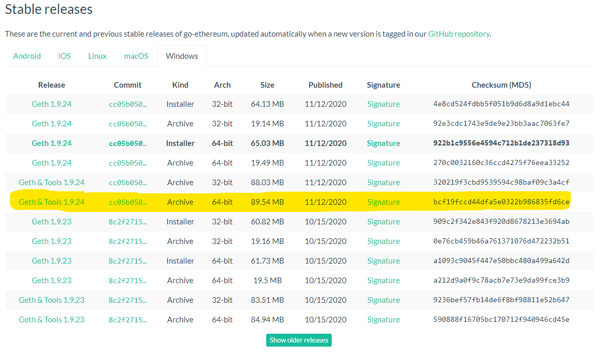

##### You'll want to download these tools into a master directory/folder.

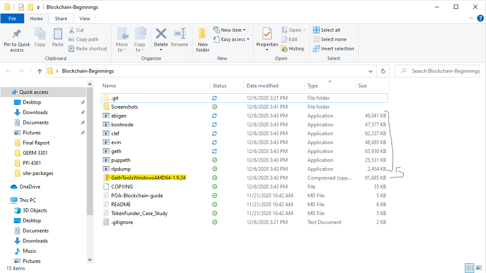

# 1) GENERATING ACCOUNTS

To begin the network, we must generate two genesis nodes. When entering these commands, you'll want to work from the directory that has the applications in it.

cd into the directory, and run these commands:

`./geth --datadir MasterNode account new`

* "./geth" calls the geth application.
* The --datadir flag creats a directory for the node
* The third piece sets a name for your first node.
* The fourth piece establishes it as an account
* The fifth piece nominates that it's new.

##### After typing in the command, you'll need to create a password
##### The password provided is not recommended, because it's incredibly weak.
##### The program will give you a public address for the key. COPY AND PASTE THIS SOMEWHERE. IT'S IMPORTANT

MasterNode
PW: admin
Public address of the key:   0x5b02b4d444d5617455bf5dbdEe7446B6dBBFe723
Path of the secret key file: MasterNode\keystore\UTC--2020-12-06T21-53-14.993467400Z--5b02b4d444d5617455bf5dbdee7446b6dbbfe723

./geth --datadir zweiterKnoten account new

zweiterKnoten (second node)
PW: german
Public address of the key:   0x8130066e626fe4B9eA60675696802ee653194926
Path of the secret key file: zweiterKnoten\keystore\UTC--2020-12-06T21-58-50.209494000Z--8130066e626fe4b9ea60675696802ee653194926

# 2) INITIALIZING EACH NODE

./geth --datadir MasterNode init zbankdeutschland.json
./geth --datadir zweiterKnoten init zbankdeutschland.json

# 3) BEGIN MINING BLOCKS

##### NOTE:
    The "enode: ADDRESS " portion of the second command may be different.
	Be sure to look for the address in the first terminal, upon the initialization
	of the mining of the first block.

#### COMMAND FOR TERMINAL 1

./geth --datadir MasterNode --unlock "5b02b4d444d5617455bf5dbdEe7446B6dBBFe723" --mine --rpc --allow-insecure-unlock

#### COMMAND FOR TERMINAL 2

./geth --datadir zweiterKnoten --unlock "8130066e626fe4B9eA60675696802ee653194926" --mine --port 30304 --bootnodes 
"enode://32bd48689bd15e40f214e83c5c2882b034fdde0c849cb502b81dc7793f506c38afb6c08b38317371778e85b4c65dd5afb5dd59639c92f1ec8bfa1103786ec6f2@127.0.0.1:30303" 
--ipcdisable --allow-insecure-unlock

* Import the keystore file from the `node1/keystore` directory into MyCrypto. This will import the private key.

* Send a transaction from the `node1` account to the `node2` account.

* Copy the transaction hash and paste it into the "TX Status" section of the app, or click "TX Status" in the popup.

* Screenshot the transaction metadata (status, tx hash, block number, etc) and save it to your Screenshots folder.

* Celebrate, you just created a blockchain and sent a transaction!

### Create a repository, and instructions for launching the chain

* Create a `README.md` in your project directory and create documentation that explains how to start the network.

* Remember to include any environment setup instructions and dependencies.

* Be sure to include all of the `geth` flags required to get both nodes to mine and explain what they mean.

* Explain the configuration of the network, such as it's blocktime, chain ID, account passwords, ports, etc.

* Explain how to connect MyCrypto to your network and demonstrate (via screenshots and steps) and send a transaction.

* Upload the code, including the `networkname.json` and node folders.

### Remember, *never* share your mainnet private keys! This is a testnet, so coins have no value here!

### Hints

* If you get stuck - try our step by step PoA Guide located [here](Resources/POA-Blockchain-guide.md).

* If you aren't seeing any movement in the wallet amounts in MyCrypto after sending/receiving transactions, try the following:
    * Terminate both nodes using `control+C` in the Node1 and Node2 terminal windows.
    * Change networks in MyCrypto to a Testnet such as Kovan.
    * Restart Node1 and Node2 in their terminal windows.
    * Reconnect to your network in MyCrypto.
    * Log into your wallet and refresh the amount.
    
* If that doesn't help make sure you are sending a large enough sum of ETH to see actual movement in the digits. You may have to click on the amount itself to see the full value down to the WEI.

    
    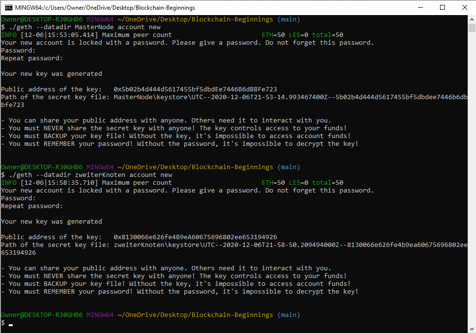
    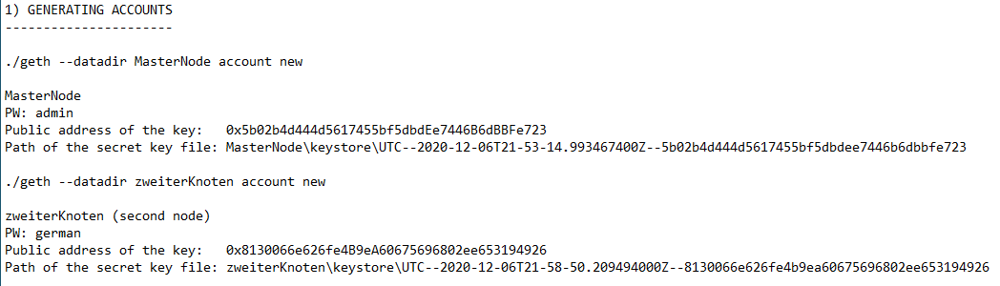
    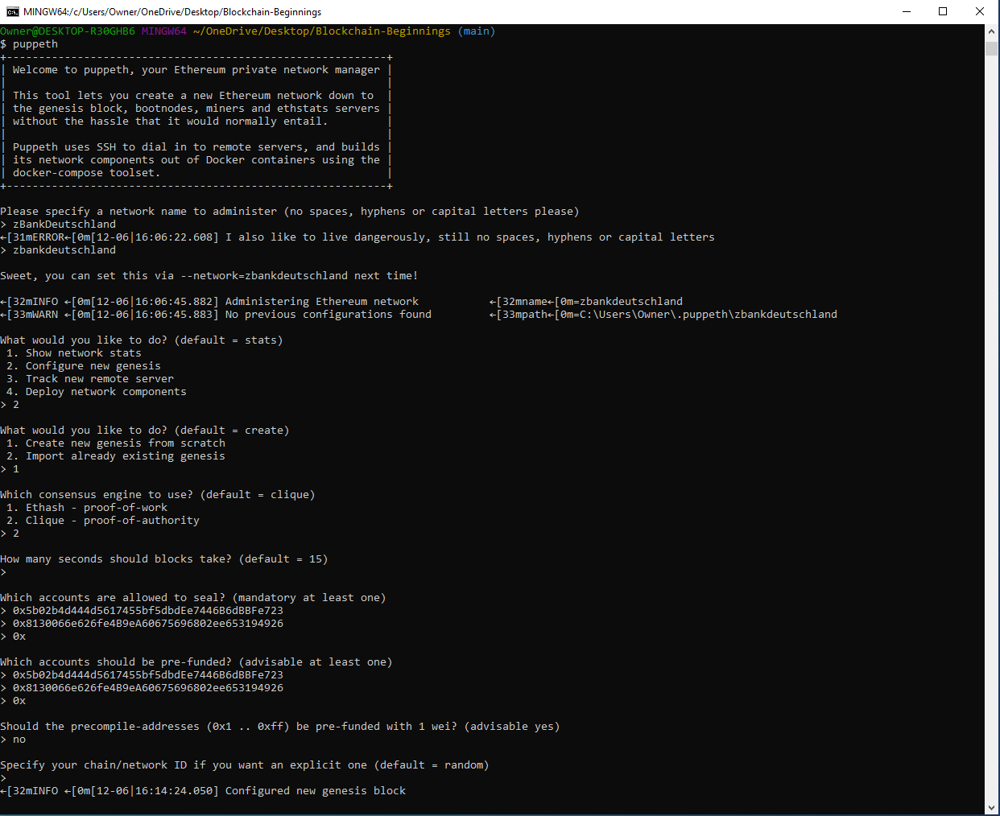
    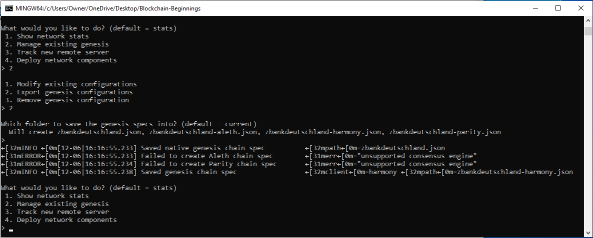
    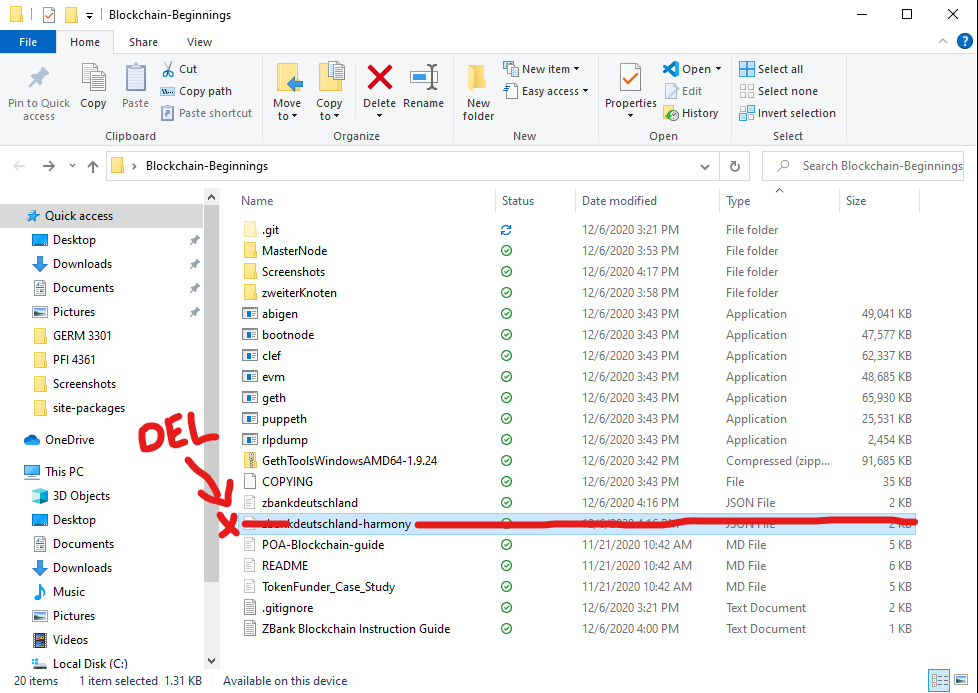
    
    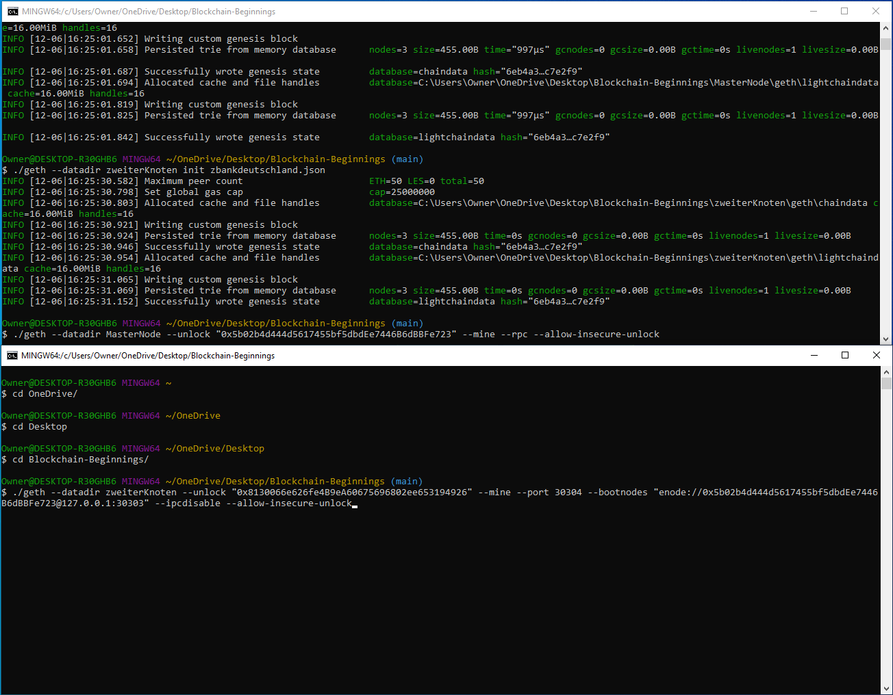
    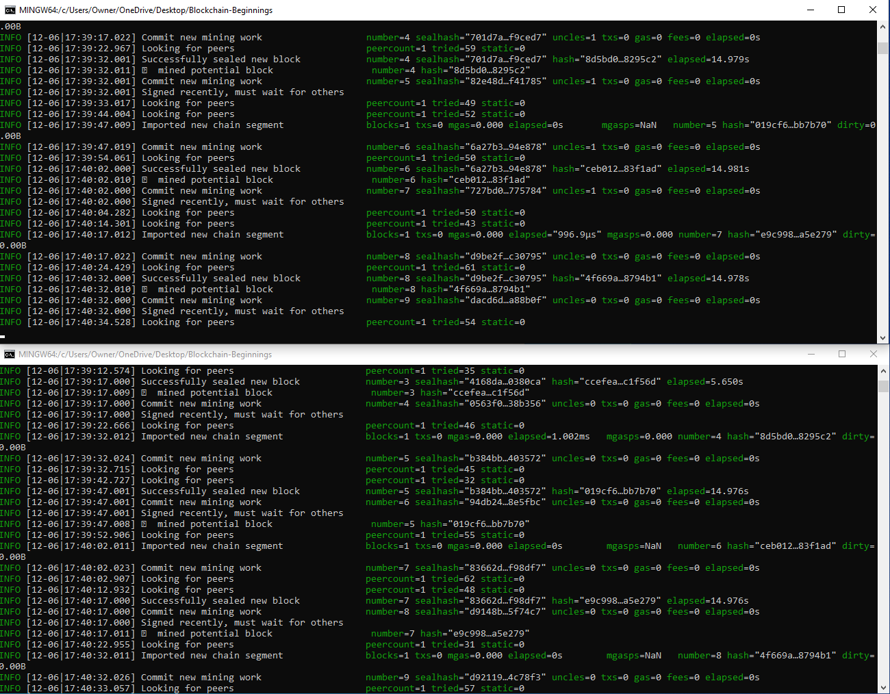
    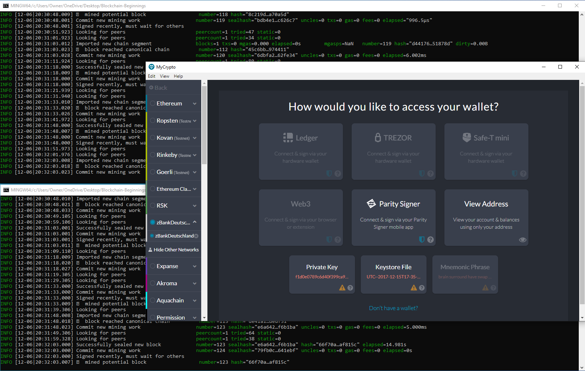
    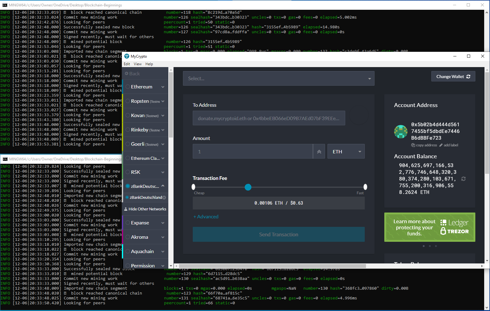
    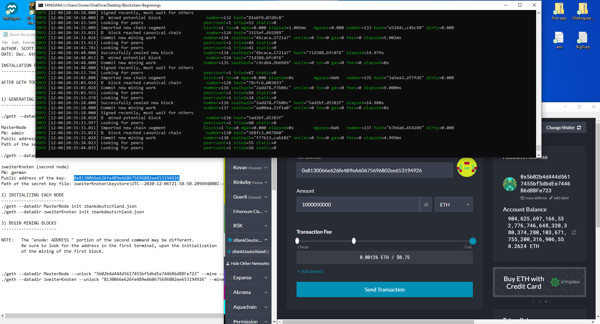
    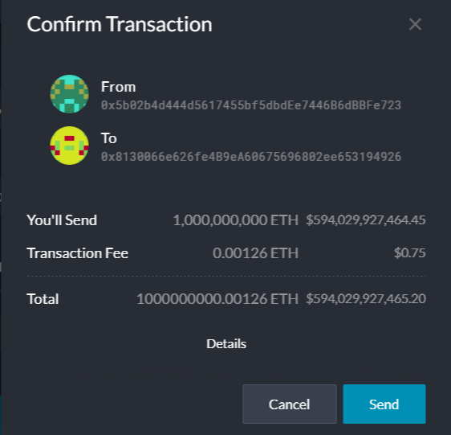
    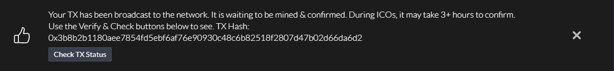
    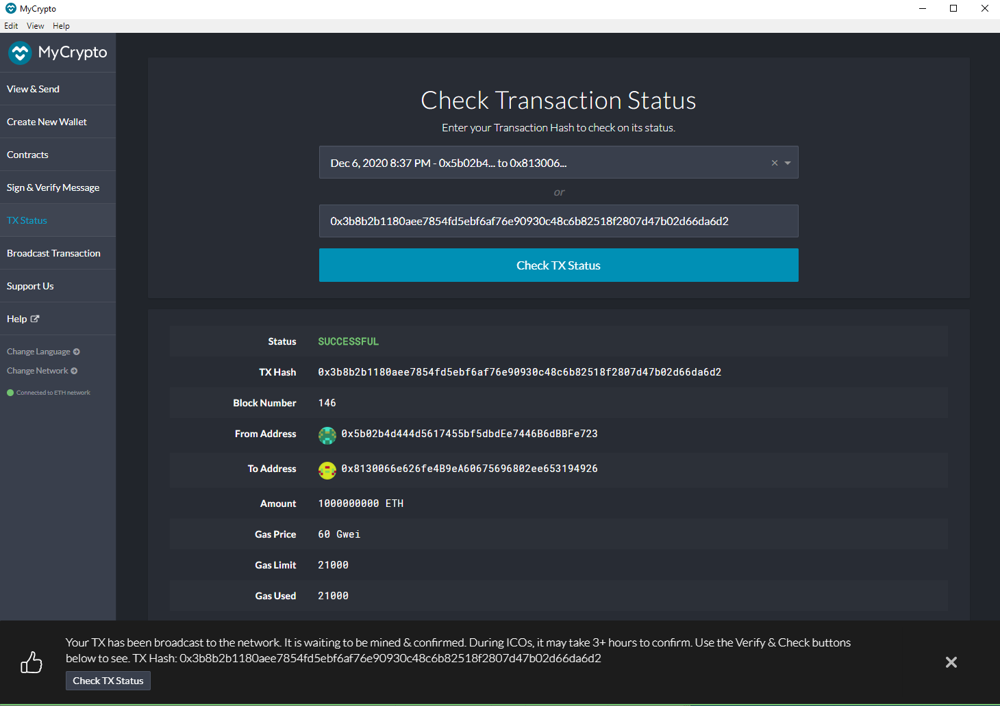

---
© 2020 Trilogy Education Services, a 2U, Inc. brand. All Rights Reserved.
