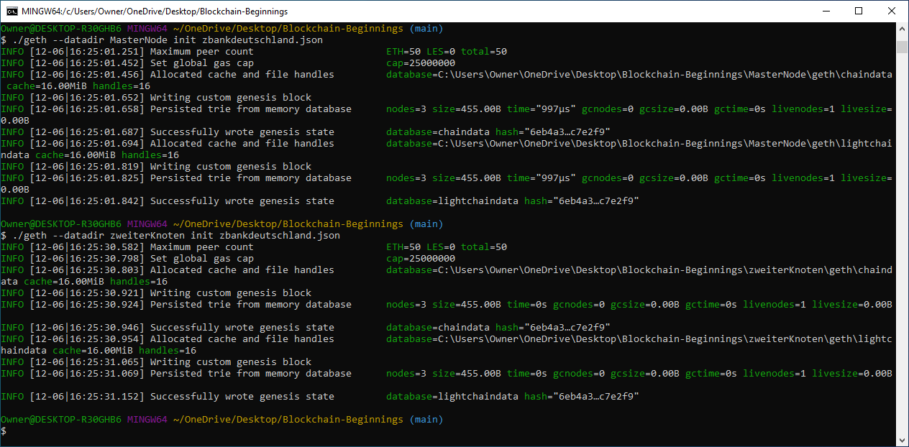

# INSTALLATION PROCESS

First, we must download and install the newest Geth Tools and Software. This can be found on geth.ethereum.org.
The download address is: https://geth.ethereum.org/downloads/

Be sure to check wether you have a Mac or Windows OS, and wether it's 32 or 64-bit. If you're using a Windows operating system, you'll want to run the terminal commands using Git Bash.

##### This is the version I downloaded for Windows 64-bit OS.

##### You'll want to download these tools into a master directory/folder. They will initially be zipped, so you should unzip the directory and place the contents in the master directory.

## 1) GENERATING ACCOUNTS

To begin the network, we must generate two genesis nodes. When entering these commands, you'll want to work from the directory that has the applications in it.

cd into the directory, and run the following command:

NOTE: You can substitute `MasterNode` and `zweiterKnoten` for whatever name you prefer.

`./geth --datadir MasterNode account new`

`./geth --datadir zweiterKnoten account new`

* "./geth" calls the geth application.
* The --datadir flag creates a directory for the node
* The third piece sets a name for your first node.
* The fourth piece establishes it as an account
* The fifth piece nominates that it's new.

After creating the node, you'll need to create a password to secure it. The passwords provided are not recommended, because they're incredibly weak. The program will give you a public addresses for the keys.

COPY AND PASTE THESE SOMEWHERE. THEY'RE IMPORTANT

Your file may look something like this

* MasterNode
* Password: admin
* Public address of the key: 0x5b02b4d444d5617455bf5dbdEe7446B6dBBFe723
* Path of the secret key file: MasterNode\keystore\UTC--2020-12-06T21-53-14.993467400Z--5b02b4d444d5617455bf5dbdee7446b6dbbfe723

* zweiterKnoten (second node)
* Password: german
* Public address of the key:   0x8130066e626fe4B9eA60675696802ee653194926
* Path of the secret key file: zweiterKnoten\keystore\UTC--2020-12-06T21-58-50.209494000Z--8130066e626fe4b9ea60675696802ee653194926

#### This is what the terminal will look like:

#### This is an example of a notepad with important information

## 2) Establishing the Network

Next, we'll want to establish the private network by linking it to the created genesis nodes. Type `puppeth` into the terminal to activate the application. You'll need to create a name for the network, using all lowercase letters, no spaces, and no hyphens. For this example, we'll be creating a Proof-of-Authority network (Clique).

The terminal will look similar to the following picture:

## 3) INITIALIZING EACH NODE

We have the network and node properties created. The next step is to combine the two. In order to do this, we will type the following commands:

`./geth --datadir MasterNode init zbankdeutschland.json`
and
`./geth --datadir zweiterKnoten init zbankdeutschland.json`

Take note, that your commands may be different because of your node names. The flags will still be the same.
* ./geth to call the geth application
* --datadir to call the data directory of the node
* the name of your node
* init flag for initializing the node
* the name of the json file for your network

It should look something like this:

## 4) BEGIN MINING BLOCKS

Now that the nodes and network are connected in code, we can begin mining with the nodes using two terminals.
Again, it's important to open two terminals to complete this step.

#### EXAMPLE COMMAND FOR TERMINAL 1

`./geth --datadir MasterNode --unlock "5b02b4d444d5617455bf5dbdEe7446B6dBBFe723" --mine --rpc --allow-insecure-unlock`

#### EXAMPLE COMMAND FOR TERMINAL 2

`./geth --datadir zweiterKnoten --unlock "8130066e626fe4B9eA60675696802ee653194926" --mine --port 30304 --bootnodes "enode://32bd48689bd15e40f214e83c5c2882b034fdde0c849cb502b81dc7793f506c38afb6c08b38317371778e85b4c65dd5afb5dd59639c92f1ec8bfa1103786ec6f2@127.0.0.1:30303" --ipcdisable --allow-insecure-unlock`

The two terminals will look similar to this:

Your code will be different. You will utilize the node names, which you've chosen, and the wallet addresses from earlier. Take note that the wallet addresses DO NOT have the "x0" from the beginning. It should also be noted, that the end of the "enode" flag will have the server's IP address, and not the one provided. 127.0.0.1 is the "local host" address for a given machine.

* ./geth calls the Geth application in the directory
* The --datadir flag calls the information from the data directory
* The third, following flag calls which data directory, which should be one of your two nodes.
* The fourth flag unlocks the node
* The fifth flag establishes the address of the node
* The sixth flag establishes the mining phase
* The seventh flag --rpc calls the JSON-RPC
* The eighth flag allows access to the node with HTTP protocol

For the second terminal, you'll also utilize other flags.
* --port # calls the port to which the second node will connect.
* --bootnodes and the enode address will connect to your first genesis node.

NOTE: The `enode: ` portion of the second command may be different. Be sure to look for the address in the first terminal, upon the initialization of the mining of the first block.

#### If your commands ran properly, and you typed in the passwords for each node, your terminals should look like the following:

## 5) CONNECTING TO YOUR NETWORK, USING MYCRYPTO

Next, open the MyCrypto application on your desktop. On the left side, choose `Change Network` towards the bottom of the list. This will open a window with the title "Set Up Your Custom Node." On the right side of the window, click the "Network" dropdown menu. Choose "Custom." Now, you'll need to fill out the boxes with the following:

* An arbitrary node name
* The name of your network
* ETH as your currency
* Your Chain ID
* The URL/IP address of your network

NOTE: DO NOT use HTTPS, USE HTTP. The port can also be found in your terminal, but should default to 8545.
NOTE: If you didn't specify a Chain ID, you can find it in your terminal. My Chain ID defaulted to 13346.
NOTE: If problems arise, you may need to restart the MyCrypto application.

Upon connection, the MyCrypto application will look similar to this:

After connecting, you should be able to access your nodes and their respective wallets, using their KeyStore files located in your master directory.

Upon opening the wallets, you'll notice a large amount of money/coins. Which should look something like this:

NOTE: Your nodes should still be running the network.

We can then try to send money from the first node to the second node. The transaction should look something like this:

# Congratulations!

Go ahead, and pat yourself on the back. You've established the blockchain network for our bank!
